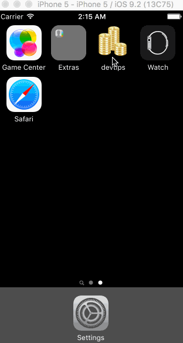

# Pre-work - Tip

Tip is a tip calculator application for iOS.

Submitted by: Julia Yu

Time spent: 8 hours spent in total

## User Stories

The following **required** functionality is complete:

* [x] User can enter a bill amount, choose a tip percentage, and see the tip and total values.
* [x] Settings page to change the default tip percentage.

The following **optional** features are implemented:
* [x] UI animations
* [x] Remembering the bill amount across app restarts (if <10mins)
* [ ] After an extended period of time, clear the state.
* [x] Using locale-specific currency and currency thousands separators.
* [x] Making sure the keyboard is always visible and the bill amount is always the first responder. This way the user doesn't have to tap anywhere to use this app. Just launch the app and start typing. (This conflicts with remembering the bill...)

The following **additional** features are implemented:

- [x] Changed the tint of all the defaults
- [x] Staggered animations - animate on completion of another animation
- [x] Only animate if there is a bill amount
- [x] Added clear to bill amount
- [x] Not sure if this is intended behavior but upon updating the default tip percent, going back to the main view will update the tip to that default since why elese would you be updating the default?
- [x] Set the bounds based on view size so its centered in other device sizes 5+

## Video Walkthrough

GIF created with [LiceCap](http://www.cockos.com/licecap/).

## Notes

Describe any challenges encountered while building the app.

## License

    Copyright [2016] Julia Yu

    Licensed under the Apache License, Version 2.0 (the "License");
    you may not use this file except in compliance with the License.
    You may obtain a copy of the License at

        http://www.apache.org/licenses/LICENSE-2.0

    Unless required by applicable law or agreed to in writing, software
    distributed under the License is distributed on an "AS IS" BASIS,
    WITHOUT WARRANTIES OR CONDITIONS OF ANY KIND, either express or implied.
    See the License for the specific language governing permissions and
    limitations under the License.